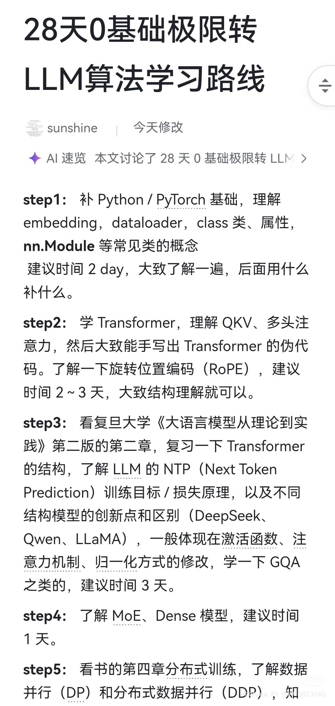
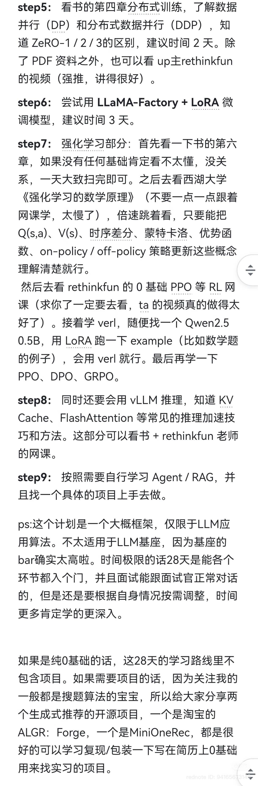

# 28 天 0 基础极限转 LLM 算法学习路线（整理版）

> 来源：`1.jpg`、`2.jpg`（sunshine + AI 速览，OCR 整理，可能存在少量识别误差）

## Step 1（建议 2 天）：补 Python / PyTorch 基础

- 了解 `embedding`、`DataLoader`、`class` / 属性、`nn.Module` 等常见概念
- 先大致过一遍，后面用到什么再补什么

## Step 2（建议 2–3 天）：学 Transformer

- 理解 QKV、多头注意力
- 大致能手写 Transformer 伪代码
- 了解旋转位置编码（RoPE）

## Step 3（建议 3 天）：LLM 训练目标与常见改动

- 阅读复旦大学《大语言模型从理论到实践》（第二版）第 2 章，复习 Transformer 结构
- 理解 NTP（Next Token Prediction）训练目标 / 损失原理
- 了解不同结构模型的创新点和区别（如 DeepSeek、Qwen、LLaMA 等在激活函数、注意力机制、归一化方式等方面的改动）
- 了解 GQA 等概念

## Step 4（建议 1 天）：了解 MoE / Dense 模型

- 了解 MoE（Mixture of Experts）与 Dense 模型差异

## Step 5（建议 2 天）：分布式训练 + ZeRO

- 阅读书的第 4 章：分布式训练
- 了解数据并行（DP）和分布式数据并行（DDP）
- 理解 ZeRO-1 / ZeRO-2 / ZeRO-3 的区别
- 补充资料：up 主 `rethinkfun`（强推，讲得很好）
- 实操：用 `LLaMA-Factory` + `LoRA` 跑一次微调

## Step 6（建议 3 天）：调模型（实践）

- 跑一遍完整流程：数据准备 → 训练 → 评估 → 迭代

## Step 7：强化学习 / RLHF（入门）

- 先看书的第 6 章：没基础看不懂很正常，建议 1 天粗读
- 再看西湖大学《强化学习的数学原理》：不要一点一点跟网课学（太慢），倍速跳读，重点把这些概念弄清：
  - `Q(s,a)`、`V(s)`、时序差分（TD）、蒙特卡洛（MC）、优势函数
  - on-policy / off-policy 策略更新
- 课程：`rethinkfun` 0 基础 PPO 等 RL 网课（强推）
- 实操：学习 `verl`，随便找一个 `Qwen2.5-0.5B`，用 `LoRA` 跑一个 example（比如数学题）
- 最后：再了解 PPO、DPO、GRPO 等

## Step 8：推理与加速

- 会用 `vLLM` 推理
- 理解 `KV Cache`、`FlashAttention` 等常见推理加速技巧（书 + `rethinkfun` 网课）

## Step 9：Agent / RAG + 项目落地

- 按需学习 Agent / RAG
- 找一个具体项目上手去做

## PS

- 这是一个大概框架，偏 LLM 应用算法；不太适用于 LLM 基座（基座门槛更高）
- 如果时间极限：28 天可以各环节入门，面试能正常对话；按自身情况调整
- 纯 0 基础：这 28 天路线里不包含项目；如需要项目，可参考两个生成式推荐开源项目：淘宝相关项目、`MiniOneRec`（适合学习复现 / 包装写简历）

## 参考图片

See also: [jihua_minionerec.md](jihua_minionerec.md)
